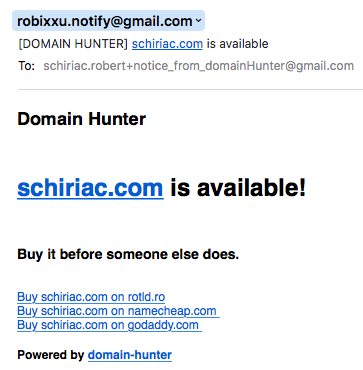

# domain-hunter
#### A small app made to "hunt" domains that are about to be available.
---
- [Demo](#demo)
- [Up & Running](#up-&-running)
- [Configure Notification](#configure-notification)
- [Up & Running Dev](#up-&-running-dev)
- [Dependencies](#dependencies)
- [Todo](#todo)

---

## Demo
#### Default: System Notification Center

#### Email Notification


---

## Up & Running

* Install [nodejs](https://nodejs.org/en/download/) if you don't have it.
* Install [PM2](https://pm2.io/doc/en/runtime/quick-start/)
```
npm install -g pm2
```
* Clone repo
```
git clone git@github.com:robiXxu/domain-hunter.git
```
* Navigate to domain-hunter directory
* Run
```
pm2 start app.js
```
* Monitoring
```
pm2 monit
```

---

## Configure Notification
#### If you are running the app on your pc then you don't have to do anything.

#### If you want to receive notification via email:
1. Duplicate .env-sample and rename the copy to .env
2. Open .env and fill with your details:
```
  // Account used to send the mail. 
  // I don't recommend using your personal email account.
  // You can create a new google account 

  DOMAIN_HUNTER_EMAIL_USER="<youremail@example.com>"
  DOMAIN_HUNTER_EMAIL_PASS="<examplePassword>"
  
  // Target email - where you want to send the email. 
  // You can use as a target email your personal email address
  // I recommend you to add a +suffix (so you can group emails) | e.g. schiriac.robert+notice_domain_hunter@gmail.com
  DOMAIN_HUNTER_EMAIL_TO="<targetemail@example.com>"
```
#### NOTE: you can also export those env variables. ( add exports in your .bashrc | .zshrc | .whatever )

---

## Up & Running Dev
* Install [nodejs](https://nodejs.org/en/download/) or [yarn](https://yarnpkg.com/en/docs/install) if you don't have it. 
* Install [PM2](https://pm2.io/doc/en/runtime/quick-start/)
```
npm install -g pm2
```
* Clone repo
```
git clone git@github.com:robiXxu/domain-hunter.git
```
* Navigate to domain-hunter directory
* Install dependencies
```
npm install
```
* Install nodemon globally
```
npm install -g nodemon
```
* Run in dev
```
npm run dev
```

---

## Dependencies
- [whois](https://en.wikipedia.org/wiki/WHOIS) - on most unix systems should be installed ( you can check by running whois in a terminal ) for Windows [follow these instructions](https://www.npmjs.com/package/whois-to-json#dependencies).

In package.json:
- [whois-to-json](https://www.npmjs.com/package/whois-to-json)
- [chalk](https://www.npmjs.com/package/chalk)
- [dotenv](https://www.npmjs.com/package/dotenv)
- [node-notifier](https://www.npmjs.com/package/node-notifier)

---

## Todo
- [x] Ability to choose between push notification or email based notification ( maybe run on a Raspberry PI )
- [x] replace whois-json with a native implementation of whois in unix systems to avoid calls. (Will not work on Win)
